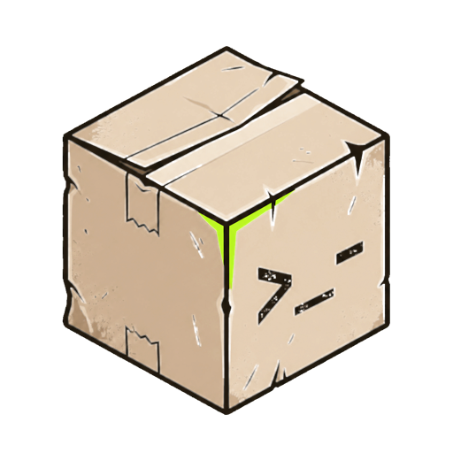

# boxsh

Run shell commands against an isolated virtual filesystem from JavaScript—in
Node.js or the browser. No host shell and no host filesystem.

> [!IMPORTANT]
> boxsh is experimental. APIs may change before the first stable release.
> Do not treat boxsh as a hardened security boundary.

## Install

```sh
npm install @boxsh/sandbox
```

boxsh requires Node.js 20 or newer. To contribute or evaluate the current
source, see the [contribution guide](docs/CONTRIBUTING.md).

## Quick start

```js
import { Filesystem, Sandbox, loadEngine, wasmMemory } from "@boxsh/sandbox";

const engine = await loadEngine();
const filesystem = await Filesystem.create({ backend: await wasmMemory() });

await filesystem.mkdir("/workspace");
await filesystem.writeFile(
  "/workspace/message.txt",
  "hello\nfrom boxsh\n",
);

const sandbox = new Sandbox({
  fs: filesystem,
  engine,
  cwd: "/workspace",
});

const result = await sandbox.exec("cat message.txt | wc -l");

console.log(result.stdout); // "2\n"
console.log(result.code);   // 0
```

`Sandbox.exec()` returns standard output, standard error, and an exit code.
Non-zero command exits are returned as results rather than thrown as
exceptions.

## What boxsh provides

- Text and binary file operations
- Directories, metadata, rename, and recursive removal
- Pipes, redirects, conditionals, variables, command substitution, heredocs,
  and simple loops
- More than 70 familiar commands, including `cat`, `cp`, `grep`, `ls`, `mkdir`,
  `rm`, `sort`, `tail`, `tee`, and `wc`
- Persistent environment variables and working directory within a sandbox
- TAR import and export
- Live migration between compatible storage backends
- Typed filesystem errors
- Node.js and browser support

The standard `wasmMemory()` backend is non-persistent — contents last for
the lifetime of the process or tab. In browsers, `indexeddb()` and `opfs()`
persist the same filesystem across reloads, and `tarfile()` opens and
snapshots workspaces as tar archives.

## Browser support

The same API works with modern browser bundlers. `loadEngine()` resolves the
bundled WebAssembly command modules as assets and fetches them on first use.
Custom URLs and CDN-hosted modules are also supported.

## Documentation

- [Getting started](docs/getting-started.md)
- [JavaScript API](docs/api.md)
- [Shell syntax and available commands](docs/commands.md)
- [Recipes and behavior](docs/behavior.md)
- [Contributing](docs/CONTRIBUTING.md)

## Current scope

boxsh provides a focused shell language rather than complete Bash
compatibility. Command flag coverage varies by command, and command output is
buffered in memory. See [Shell syntax and available commands](docs/commands.md)
for the supported surface and current limitations.

## Help and contributing

Use [GitHub issues](https://github.com/NishantJoshi00/boxsh/issues) for bug
reports, feature requests, and questions. Pull requests are welcome; read the
[contribution guide](docs/CONTRIBUTING.md) before getting started.

## License

Licensed under either the [Apache License 2.0](LICENSE-APACHE) or the
[MIT License](LICENSE-MIT), at your option.
